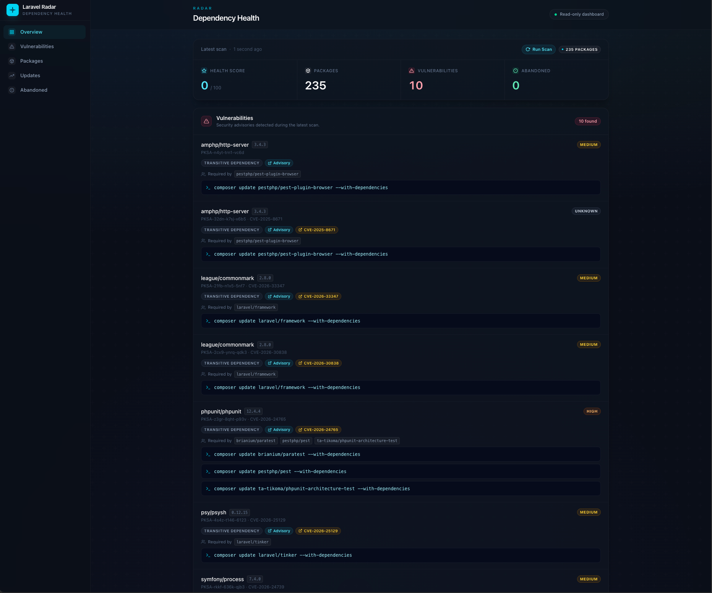

<p align="center">
    <h1 align="center">Laravel Radar</h1>
    <p align="center">
        <a href="https://packagist.org/packages/joshdonnell/radar"></a>
        <a href="https://github.com/JoshDonnell/radar/actions/workflows/tests.yml"></a>
        <a href="https://github.com/JoshDonnell/radar/actions/workflows/formats.yml"></a>
        <a href="https://github.com/JoshDonnell/radar/blob/main/LICENSE.md"></a>
    </p>
</p>

## Introduction

**Laravel Radar** is a lightweight dependency health dashboard and notifier for Laravel applications.

Radar scans Composer and NPM dependencies, stores a snapshot, and highlights:

- vulnerable packages
- outdated direct dependencies
- abandoned Composer packages
- practical, conservative next steps

Radar is intentionally read-only. It reports dependency health and suggests commands, but it does **not** update dependencies, edit lock files, commit changes, or deploy code for you.

<p align="center">
    
</p>

## Requirements

- PHP 8.3+
- Laravel 12 or 13
- Composer
- Node/NPM available when scanning JavaScript dependencies

## Installation

Install Radar with Composer:

```bash
composer require joshdonnell/radar
```

Publish Radar's config file, migration, and dashboard assets:

```bash
php artisan radar:install
```

Run the migration:

```bash
php artisan migrate
```

## Usage

Run a dependency scan:

```bash
php artisan radar:scan
```

Open the dashboard at:

```txt
/radar
```

The dashboard path can be changed with:

```env
RADAR_PATH=internal/radar
```

Radar's dashboard is enabled outside production by default and disabled in production by default. Production applications can still run scans and send notifications. Only enable the dashboard in production when it is protected by trusted authentication and authorization.

```env
RADAR_DASHBOARD_ENABLED=true
```

## Commands

Radar currently ships these Artisan commands:

```bash
php artisan radar:scan
php artisan radar:notify
php artisan radar:clear
```

### `radar:scan`

Scans application dependencies and stores a Radar snapshot.

```bash
php artisan radar:scan
```

Scan a different project path:

```bash
php artisan radar:scan --path=/path/to/app
```

Use CI mode in a pipeline after installing dependencies:

```bash
php artisan radar:scan --ci --severity=high
```

The `--ci` flag makes `radar:scan` return a failing status when vulnerabilities meet the configured severity threshold. Your CI provider does not need special handling. It only needs to run the command and respect the exit code.

Set `--severity` to `low`, `medium`, `high`, or `critical`. Radar returns `1` when a vulnerability is at or above that threshold, `0` when none are, and `2` when the CI options or scan path are invalid.

### `radar:notify`

Sends deduplicated vulnerability notifications for the latest stored scan.

```bash
php artisan radar:notify
```

Run a fresh scan before notifying:

```bash
php artisan radar:notify --scan
```

Notifications are only sent when vulnerabilities exist and at least one notification route is configured.

### `radar:clear`

Clears stored Radar scan history.

```bash
php artisan radar:clear
```

Skip the confirmation prompt:

```bash
php artisan radar:clear --force
```

## Dashboard

The dashboard shows the latest stored scan, including:

- health score
- latest scan time
- Composer and NPM package inventory
- vulnerability findings
- outdated direct dependency findings
- abandoned Composer package findings
- suggested safe commands or review steps where Radar can infer them

## Notifications

Radar uses Laravel Notifications. Your application still owns the normal mail and Slack transport configuration; Radar only stores the on-demand notification routes it should target.

Configure mail recipients:

```env
RADAR_NOTIFICATION_MAIL_TO=security@example.com,dev@example.com
```

Configure Slack:

```env
RADAR_NOTIFICATION_SLACK_WEBHOOK_URL=https://hooks.slack.com/services/...
```

Send notifications manually:

```bash
php artisan radar:notify
```

Or scan first, then notify:

```bash
php artisan radar:notify --scan
```

Repeated notifications for the same vulnerability finding set are deduplicated for the configured TTL:

```env
RADAR_NOTIFICATION_DEDUPE_TTL=86400
```

## Scheduling

Radar preconfigures a nightly scheduled `radar:notify --scan` run at `02:00`, so each notification run starts with a fresh scan.

Your application still needs Laravel's scheduler running in production, usually via a cron entry that runs `php artisan schedule:run` every minute.

Customize or disable Radar's built-in schedule:

```env
RADAR_NOTIFICATION_SCHEDULE_ENABLED=true
RADAR_NOTIFICATION_SCHEDULE_TIME=02:00
RADAR_NOTIFICATION_SCHEDULE_TIMEZONE=Europe/London
```

## Authorization

Radar checks the configured gate outside local environments before serving the dashboard.

Define the gate in your application, for example:

```php
use Illuminate\Support\Facades\Gate;

Gate::define('viewRadar', fn ($user = null): bool => $user?->is_admin === true);
```

If you publish the config, you can change the gate name by editing the `authorization.gate` value in `config/radar.php`.

## Configuration

Publish the configuration file with:

```bash
php artisan vendor:publish --tag="radar-config"
```

Useful environment variables:

```env
RADAR_ENABLED=true
RADAR_PATH=radar
RADAR_DASHBOARD_ENABLED=false
RADAR_DB_CONNECTION=sqlite
RADAR_PRUNE_DAYS=30
RADAR_COMMAND_TIMEOUT=60
RADAR_NOTIFICATION_MAIL_TO=security@example.com
RADAR_NOTIFICATION_SLACK_WEBHOOK_URL=
RADAR_NOTIFICATION_DEDUPE_TTL=86400
RADAR_NOTIFICATION_SCHEDULE_ENABLED=true
RADAR_NOTIFICATION_SCHEDULE_TIME=02:00
RADAR_NOTIFICATION_SCHEDULE_TIMEZONE=
```

See [the configuration documentation](docs/configuration.md) for the full config reference.

## Dependency sources

Radar reads dependency information from package manager files and installed package metadata.

Composer support includes:

- package inventory from `composer.lock`
- fallback inventory from `vendor/composer/installed.json`
- vulnerability findings from `composer audit --format=json`
- outdated direct dependencies from Composer's outdated output
- abandoned package metadata from Composer package data

NPM support includes:

- package inventory from `package-lock.json`
- fallback direct package inventory from `node_modules/*/package.json`
- vulnerability findings from `npm audit --json`
- outdated direct dependencies from NPM's outdated output

## Supported Node runners

Radar detects the JavaScript package manager from the project lock file and uses that runner when suggesting safe NPM update commands.

| Lock file | Runner | Example recommendation |
| --- | --- | --- |
| `package-lock.json` | npm | `npm update vite` |
| `npm-shrinkwrap.json` | npm | `npm update vite` |
| `yarn.lock` | Yarn | `yarn up vite` |
| `pnpm-lock.yaml` | pnpm | `pnpm update vite` |
| `bun.lock` | Bun | `bun update vite` |
| `bun.lockb` | Bun | `bun update vite` |

If no known lock file exists, Radar falls back to npm.

## Testing

Run the PHP checks:

```bash
composer test
```

Run frontend checks while working on dashboard assets:

```bash
npm run test:lint
npm run test:types
npm run build
```

## License

Laravel Radar is open-sourced software licensed under the [MIT license](LICENSE.md).
