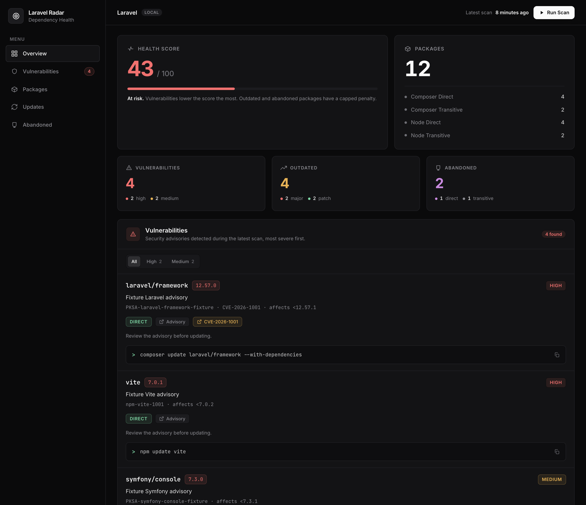

<p align="center">
    <h1 align="center">Laravel Radar</h1>
    <p align="center">
        <a href="https://packagist.org/packages/joshdonnell/radar"></a>
        <a href="https://github.com/JoshDonnell/radar/actions/workflows/tests.yml"></a>
        <a href="https://github.com/JoshDonnell/radar/actions/workflows/formats.yml"></a>
        <a href="https://github.com/JoshDonnell/radar/blob/main/LICENSE.md"></a>
    </p>
</p>

## Introduction

**Laravel Radar** is a lightweight dependency health dashboard and notifier for Laravel applications.

Radar scans Composer and NPM dependencies, stores a snapshot, and highlights:

- vulnerable packages
- outdated direct dependencies
- abandoned Composer packages
- practical, conservative next steps

Radar is intentionally read-only. It reports dependency health and suggests commands, but it does **not** update dependencies, edit lock files, commit changes, or deploy code for you.

<p align="center">
    
</p>

## Requirements

- PHP 8.3+
- Laravel 12 or 13
- Composer
- Node/NPM available when scanning JavaScript dependencies

## Installation

Install Radar with Composer:

```bash
composer require joshdonnell/radar
```

Publish Radar's config file, migration, and dashboard assets:

```bash
php artisan radar:install
```

Run the migration:

```bash
php artisan migrate
```

## Usage

Run a dependency scan:

```bash
php artisan radar:scan
```

Open the dashboard at:

```txt
/radar
```

The dashboard path can be changed with:

```env
RADAR_PATH=internal/radar
```

Radar's dashboard is enabled outside production by default and disabled in production by default. Production applications can still run scans and send notifications. Only enable the dashboard in production when it is protected by trusted authentication and authorization.

```env
RADAR_DASHBOARD_ENABLED=true
```

## Commands

Radar ships these Artisan commands:

```bash
php artisan radar:install
php artisan radar:scan
php artisan radar:notify
php artisan radar:clear
php artisan radar:upgrade
```

### `radar:install`

Publishes Radar's config file, migration, and dashboard assets. Run it once after installing the package.

```bash
php artisan radar:install
```

### `radar:scan`

Scans application dependencies and stores a Radar snapshot.

```bash
php artisan radar:scan
```

Scan a different project path:

```bash
php artisan radar:scan --path=/path/to/app
```

Use CI mode in a pipeline after installing dependencies:

```bash
php artisan radar:scan --ci --severity=high
```

The `--ci` flag makes `radar:scan` return a failing status when vulnerabilities meet the configured severity threshold. Your CI provider does not need special handling. It only needs to run the command and respect the exit code.

Set `--severity` to `low`, `medium`, `high`, or `critical`. Radar returns these exit codes:

| Exit code | Meaning |
| --- | --- |
| `0` | No vulnerabilities at or above the threshold. |
| `1` | At least one vulnerability is at or above the threshold. |
| `2` | The CI options or scan path are invalid, or a dependency audit could not run. |

An audit that could not run (for example because `composer` is missing, the network is down, or the command timed out) returns `2` rather than passing, because a clean result cannot be trusted in that case.

### Incomplete scans

When a check cannot run, Radar records a warning on the scan instead of silently reporting zero findings. Warnings are printed by `radar:scan`, shown as a banner on the dashboard, and turn a CI run into exit code `2`. Common causes:

- a package manager binary is not on the `PATH` of the process running the scan
- an audit command timed out (see `RADAR_COMMAND_TIMEOUT`)
- the package manager has no audit or outdated command Radar can read (see [Supported Node runners](#supported-node-runners))

### `radar:notify`

Sends a notification for vulnerabilities in the latest stored scan that have not been notified about yet.

```bash
php artisan radar:notify
```

Run a fresh scan before notifying:

```bash
php artisan radar:notify --scan
```

Notifications are only sent when vulnerabilities exist and at least one notification route is configured.

### `radar:clear`

Clears stored Radar scan history.

```bash
php artisan radar:clear
```

Skip the confirmation prompt:

```bash
php artisan radar:clear --force
```

### `radar:upgrade`

Re-publishes the dashboard assets. Run it after upgrading Radar. The dashboard shows a banner when the published assets are out of date.

```bash
php artisan radar:upgrade
```

## Dashboard

The dashboard shows the latest stored scan, including:

- health score
- vulnerabilities by severity, with advisory titles, CVE links, and severity filters
- outdated direct dependencies by update type (major, minor, patch)
- abandoned Composer packages and their suggested replacements
- a searchable, sortable package inventory filterable by package manager, relation, and dependency type, with each package flagged as vulnerable, outdated, or abandoned
- suggested commands to copy, with alternatives for transitive vulnerabilities
- warnings when part of a scan could not run

It follows your system's light or dark preference. Press `/` to jump to the package search.

### Running scans from the dashboard

The **Run Scan** button queues a scan as a background job, because a scan can take longer than a web request is allowed to run. The dashboard polls until the job finishes, and reports an error if it fails.

This needs a queue worker:

```bash
php artisan queue:work
```

If the scan stays queued for more than two minutes, the dashboard reminds you to check that a worker is running. With the `sync` queue driver the scan runs during the request instead.

Choose a specific connection or queue with:

```env
RADAR_QUEUE_CONNECTION=redis
RADAR_QUEUE=radar
```

Only one dashboard scan can be queued at a time, and the endpoint is rate limited to 10 requests per minute.

## Notifications

Radar uses Laravel Notifications. Your application still owns the normal mail and Slack transport configuration; Radar only stores the on-demand notification routes it should target.

Configure mail recipients:

```env
RADAR_NOTIFICATION_MAIL_TO=security@example.com,dev@example.com
```

Configure Slack:

```env
RADAR_NOTIFICATION_SLACK_WEBHOOK_URL=https://hooks.slack.com/services/...
```

Send notifications manually:

```bash
php artisan radar:notify
```

Or scan first, then notify:

```bash
php artisan radar:notify --scan
```

Each vulnerability is announced once. Later runs only notify about vulnerabilities that are new since the last notification, so an unresolved finding does not send an email every night, and resolving one vulnerability does not re-send the others. A vulnerability that is resolved and later comes back is announced again.

Only notify about findings at or above a severity (`low`, `medium`, `high`, or `critical`):

```env
RADAR_NOTIFICATION_MIN_SEVERITY=high
```

Findings with an unknown severity are included only when the minimum is `low`.

To be reminded about vulnerabilities that are still unresolved, set a reminder interval in seconds. Reminders are off by default.

```env
RADAR_NOTIFICATION_REMIND_AFTER=604800
```

Radar remembers which vulnerabilities it has notified about in your application's cache, so use a persistent cache store in production.

## Scheduling

Radar preconfigures a nightly scheduled `radar:notify --scan` run at `02:00`, so each notification run starts with a fresh scan. The scheduled run uses `onOneServer()`, so it only runs once when your application is deployed to several servers (this needs a cache store that supports atomic locks).

Your application still needs Laravel's scheduler running in production, usually via a cron entry that runs `php artisan schedule:run` every minute.

Customize or disable Radar's built-in schedule:

```env
RADAR_NOTIFICATION_SCHEDULE_ENABLED=true
RADAR_NOTIFICATION_SCHEDULE_TIME=02:00
RADAR_NOTIFICATION_SCHEDULE_TIMEZONE=Europe/London
```

## Authorization

Radar checks the configured gate outside local environments before serving the dashboard.

Define the gate in your application, for example:

```php
use Illuminate\Support\Facades\Gate;

Gate::define('viewRadar', fn ($user = null): bool => $user?->is_admin === true);
```

If you publish the config, you can change the gate name by editing the `authorization.gate` value in `config/radar.php`.

## Configuration

Publish the configuration file with:

```bash
php artisan vendor:publish --tag="radar-config"
```

Useful environment variables:

```env
RADAR_ENABLED=true
RADAR_PATH=radar
RADAR_DASHBOARD_ENABLED=false
RADAR_DB_CONNECTION=sqlite
RADAR_PRUNE_DAYS=30
RADAR_COMMAND_TIMEOUT=60
RADAR_SCORING_OUTDATED_PENALTY_CAP=30
RADAR_SCORING_ABANDONED_PENALTY_CAP=30
RADAR_QUEUE_CONNECTION=
RADAR_QUEUE=
RADAR_NOTIFICATION_MAIL_TO=security@example.com
RADAR_NOTIFICATION_SLACK_WEBHOOK_URL=
RADAR_NOTIFICATION_MIN_SEVERITY=low
RADAR_NOTIFICATION_REMIND_AFTER=
RADAR_NOTIFICATION_SCHEDULE_ENABLED=true
RADAR_NOTIFICATION_SCHEDULE_TIME=02:00
RADAR_NOTIFICATION_SCHEDULE_TIMEZONE=
```

Every option is documented in the published `config/radar.php` file.

## Dependency sources

Radar reads dependency information from package manager files and installed package metadata. The audit and outdated commands run in parallel to keep scans fast.

Composer support includes:

- package inventory from `composer.lock`
- fallback inventory from `vendor/composer/installed.json`
- vulnerability findings from `composer audit --format=json`
- outdated direct dependencies from Composer's outdated output
- abandoned package metadata from Composer package data

NPM support includes:

- package inventory from `package-lock.json`
- fallback direct package inventory from `node_modules/*/package.json`
- vulnerability findings from `npm audit --json`
- outdated direct dependencies from NPM's outdated output

The full Node package tree (including transitive packages) is read from `package-lock.json`. Yarn, pnpm, and Bun projects only list their direct dependencies, and the scan records a warning saying so. Vulnerabilities in transitive packages are still reported when the runner's audit command can find them.

## Supported Node runners

Radar detects the JavaScript package manager from the project lock file and uses that runner when suggesting safe NPM update commands.

| Lock file | Runner | Example recommendation |
| --- | --- | --- |
| `package-lock.json` | npm | `npm update vite` |
| `npm-shrinkwrap.json` | npm | `npm update vite` |
| `yarn.lock` | Yarn | `yarn up vite` |
| `pnpm-lock.yaml` | pnpm | `pnpm update vite` |
| `bun.lock` | Bun | `bun update vite` |
| `bun.lockb` | Bun | `bun update vite` |

If no known lock file exists, Radar falls back to npm.

Not every runner supports every check:

| Runner | Vulnerability audit | Outdated check | Fix for transitive vulnerabilities |
| --- | --- | --- | --- |
| npm | `npm audit --json` | `npm outdated --json` | `npm audit fix` |
| Yarn | `yarn audit --json` | Not supported | `yarn up -R <package>` |
| pnpm | `pnpm audit --json` | `pnpm outdated --json` | Update the parent package |
| Bun | Not supported | Not supported | Update the parent package |

Unsupported checks are recorded as scan warnings rather than reported as clean.

## Upgrading from 0.1

- `RADAR_NOTIFICATION_DEDUPE_TTL` (`notifications.dedupe_ttl`) has been removed. Notifications are now sent once per vulnerability. Use `RADAR_NOTIFICATION_REMIND_AFTER` if you want reminders about unresolved vulnerabilities.
- Dashboard scans now run on the queue. Run a queue worker, or use the `sync` driver.
- Run `php artisan radar:upgrade` to publish the new dashboard assets.

## Testing

Run the PHP checks:

```bash
composer test
```

Run frontend checks while working on dashboard assets:

```bash
npm run test:lint
npm run test:types
npm run build
```

## License

Laravel Radar is open-sourced software licensed under the [MIT license](LICENSE.md).
